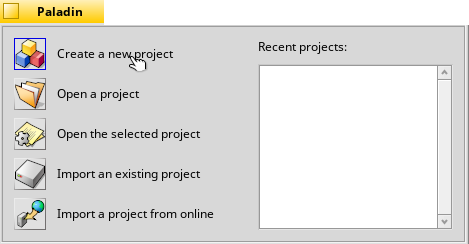
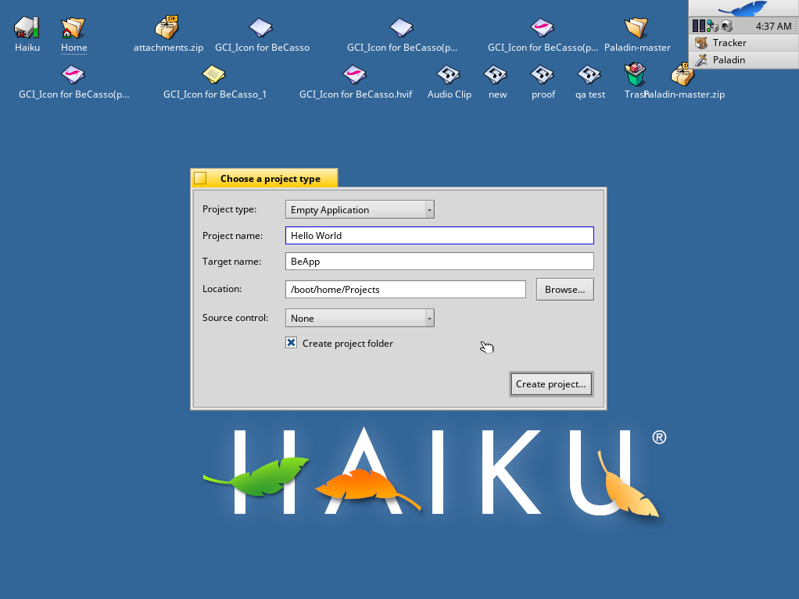
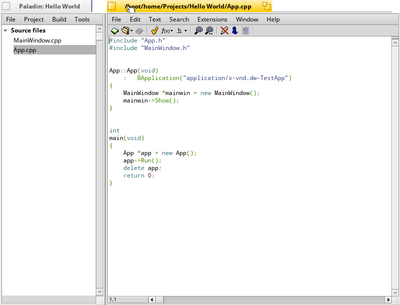
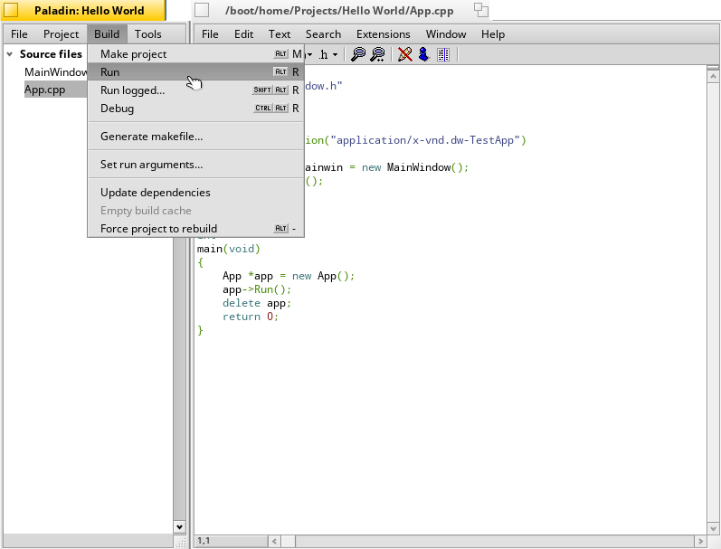

PALADIN

 =========

Paladin is an open source integrated development environment (IDE) modeled after BeOS' BeIDE. 

FEATURES

 - Command-line build support

 - More run options for projects

 - Explicit support for debugging with gdb under Haiku

 - Bundled helper tools

 - Projects can include notes and other files that aren't source code

  - Project templates

 - Integrated source code management

 - 1-click project backups

SETTING UP PALADIN

 - Install Paladin from Haiku Depot

 - Open Paladin

 - Select 'Create New Project'

 - Select Project Type from the dropdown menu, give your project a name, a file name    and save destination and click 'Create Project'

 - Select the file you want to code

 

 - Push Alt+R to compile and run your program

 

LICENSE: MIT.  
