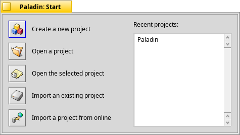
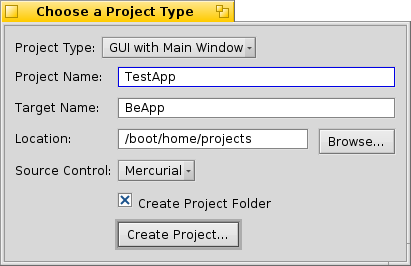
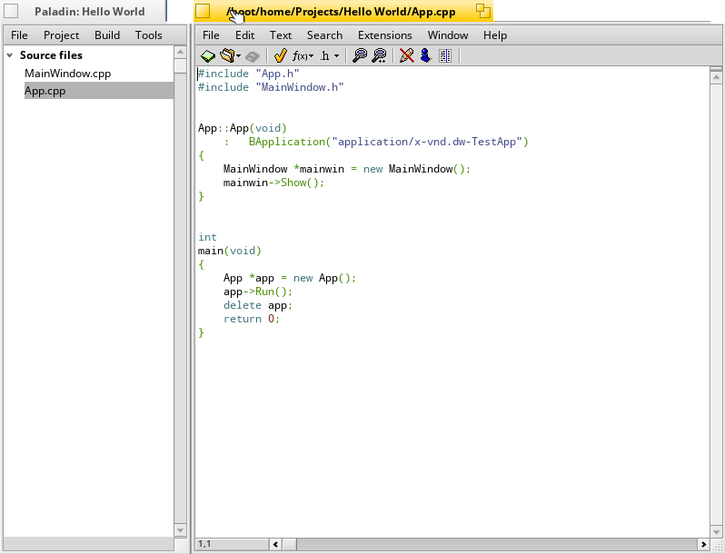
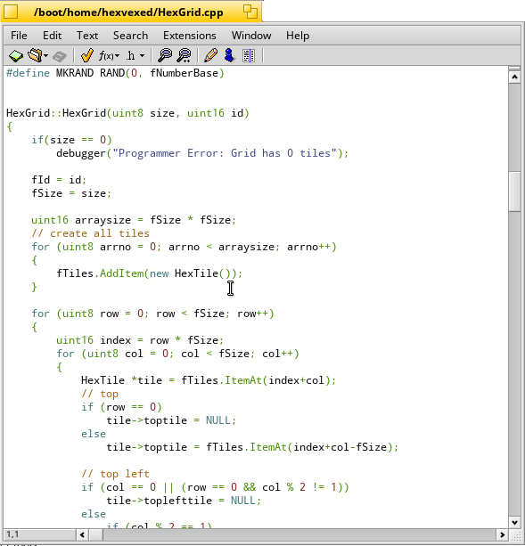
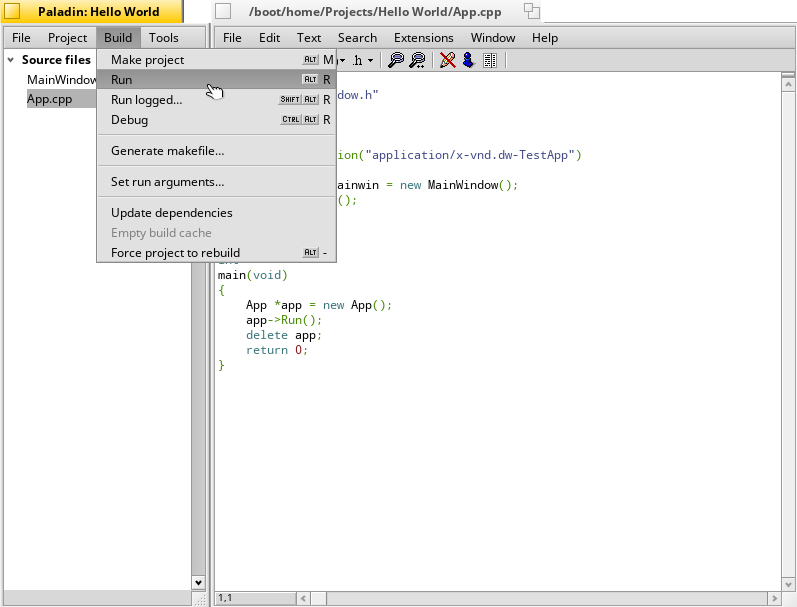
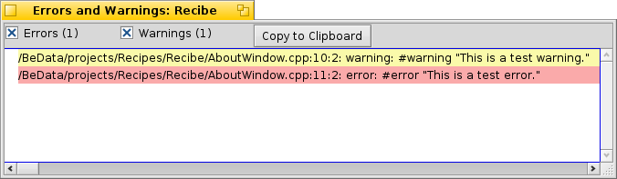
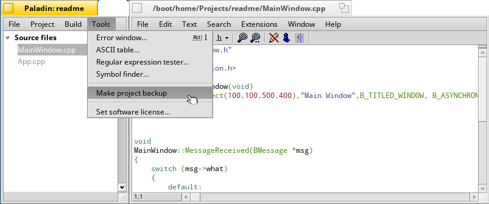
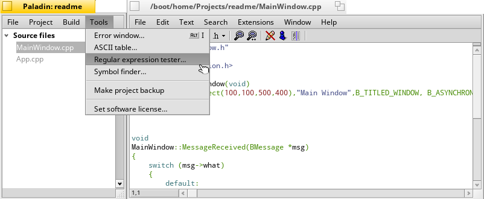

PALADIN

 =========

Paladin is an open source integrated development environment (IDE) modeled after BeOS' BeIDE. 

 FEATURES

   - Command-line build support

   - Multithreaded builds

   - Revision control-friendly project files

   - More run options for projects

   - Explicit support for debugging with gdb under Haiku

   - Bundled helper tools

   - Streamlined project settings

   - Out-of-the-box support for Lex and Yacc

   - Support for text and binary resource files

   - Projects can include notes and other files that aren't source code

   - Project templates

   - Out-of-the-box makefile generation

   - Integrated source code management

   - 1-click project backups

 STARTING A PROJECT

   - Install Paladin from Haiku Depot

   -  Open Paladin

   -  Select 'Create New Project'

  
  -  Select Project Type from the dropdown menu, give your project a name, a file name and save destination and click 'Create Project'

  
  -  Select the file you want to code

                   

              (A blank editor file)

 Here's how a coded editor file looks like

           (Code excerpt from HexVexed) 

 
  - Push Alt+R to compile and run your program

 

SOME VERY USEFUL FEATURES

  - DEALING WITH ERRORS
     
       While warnings will not stop Paladin from continuing to build a project, if an error occurs, Paladin will stop the build so that the errors can be corrected. Errors are listed in pink; warnings are listed in yellow. Double-clicking on an error or warning will open up the file containing it in the editor. The Copy to Clipboard button will copy all visible errors and/or warnings to the system clipboard for pasting into other documents.    

  
  - BACKING UP PROJECTS

      Your project can be quickly placed into a compressed archive in a folder of your choosing with your project's name and timestamp for the backup with just a click of this menu item.

  
  - HELPER TOOLS

     Developers seem to need a wide variety of tools when writing code. Paladin includes a few small accessories to complement the main development environment. They can be accessed from the Tools menu.

           

LICENSE: MIT.  
