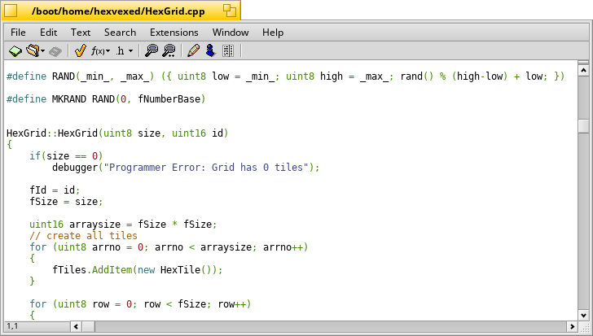
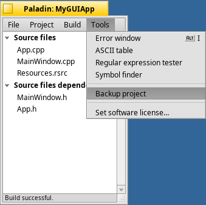

# Paladin
 
Paladin is an open source integrated development environment (IDE) modeled after BeOS' BeIDE. It can use fastdep and ccache to speed up builds if you have them installed.

To build: run `pkgman install devel:libpcre unittest++_devel` and then run `./buildsuite.sh 1`

## Features

- Command-line build support

- Quick Find a file by name with Alt+F, with abbreviations (E.g. QFW finds QuickFindWindow.cpp)

- Multithreaded builds

- Revision control-friendly project files

- More run options for projects

- Explicit support for debugging with gdb under Haiku

- Bundled helper tools

- Streamlined project settings

- Out-of-the-box support for Lex and Yacc

- Support for text and binary resource files

- Projects can include notes and other files that aren't source code

- Project templates

- Out-of-the-box makefile generation

- Integrated source code management

- 1-click project backups

## Starting a Project
- Install Paladin from HaikuDepot.

- Open Paladin.

- Select `Create New Project`.

  
- Select `Project Type` from the dropdown menu, give your project a name, a file name and save destination and click `Create Project`.

  
- Select the file you want to code in.

Here's how an editor window looks like:

*(Code excerpt from HexVexed)*
 
- Press `Alt+R` to compile and run your program.

## Some Very Useful Features
### Dealing with Errors

While warnings will not stop Paladin from continuing to build a project, if an error occurs, Paladin will stop the build so that the errors can be corrected. Errors are listed in pink; warnings are listed in yellow.
Double-clicking on an error or warning will open up the file containing it in the editor. The `Copy to Clipboard` button will copy all visible errors and/or warnings to the system clipboard for pasting into other documents. 

  
### Backing Up Projects
Your project can be quickly placed into a compressed archive in a folder of your choosing with your project's name and timestamp for the backup with just a click of this menu item.

  
### Helper Tools

Developers seem to need a wide variety of tools when writing code. Paladin includes a few small accessories to complement the main development environment. An ASCII table, Regular expression tester, Symbol finder and a tool to easily choose a license for your project can be accessed from the `Tools menu`.

### License
MIT
