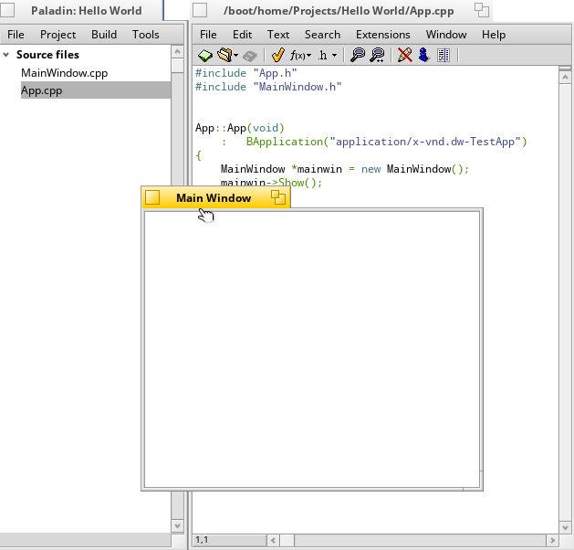

PALADIN

 =========

Paladin is an open source integrated development environment (IDE) modeled after BeOS' BeIDE. 

INSTALLING PALADIN
 - OpenHaikuDepot

 - Enter 'paladin' in the search bar

 - Click the paladin package and select 'Install'

 - Select 'Open Paladin

SETTING UP PALADIN

 - Open Paladin

 - Select 'Create New Project'

 - Select Project Type from the dropdown menu

 - Give the Project a name

 - Give the file a name

 -Select the location where the project is to be saved

 - Click 'Create Project'

 - Select the file to code

 

 - Push Alt+R to compile and run your program

 

LICENSE: MIT.  
