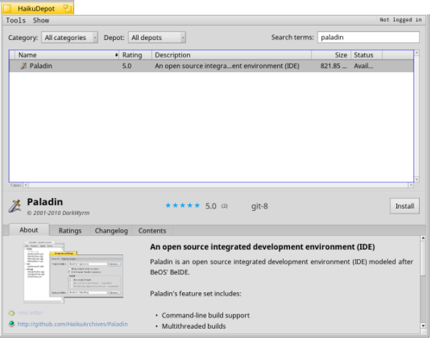
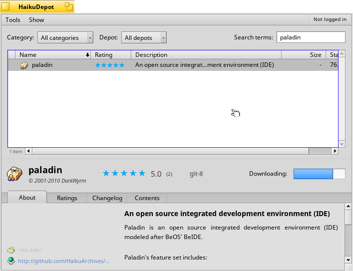
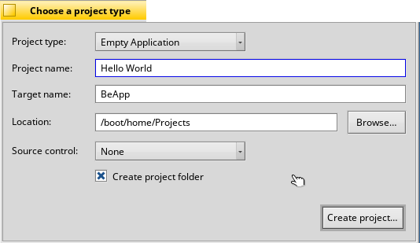
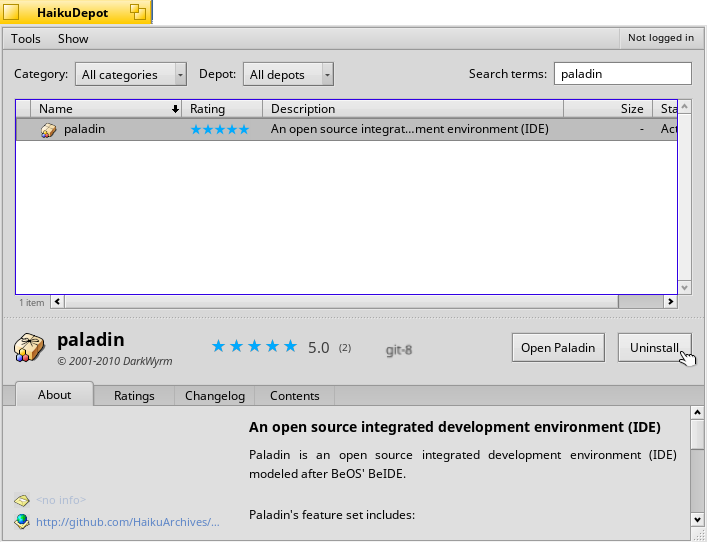

PALADIN

 =========

Paladin is an open source integrated development environment (IDE) modeled after BeOS' BeIDE. It can use fastdep and ccache to speed up builds if you have them installed.
To build: run `pkgman install devel:libpcre` and then run `./buildsuite.sh`.

INSTALLING PALADIN
 1. OpenHaikuDepot

 2. Enter 'paladin' in the search bar

 3. Click the paladin package and select 'Install'

 4. Select 'Open Paladin

SETTING UP PALADIN
 1. Open Paladin

 2. Select 'Create New Project'

 3. Select Project Type from the dropdown menu

 4. Give the Project a name

 5. Give the file a name

 6. Select the location where the project is to be saved

 7. Click 'Create Project'

 8. Select the file to code
 
 9. Push Alt+R to compile and run your program
 

UNINSTALLING PALADIN
 1. OpenHaikuDepot
 2. Enter 'paladin' in the search bar

 3. Click the paladin package and select 'Uninstall'

LICENSE: MIT.  
